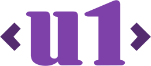

# u1
The Home of the U1 project

  

## Features

U1 is a design system that is intended to fulfill the following goals as well as possible:

- Based on standards
- Minimal
- Tooling is optional

## Demos

[boilerplate.html](https://raw.githack.com/u1ui/u1/main/tests/boilerplate.html)  
[showcase.html](https://raw.githack.com/u1ui/u1/main/tests/showcase.html)  
[test.html](https://raw.githack.com/u1ui/u1/main/tests/test.html)  

## About

- MIT License, Copyright (c) 2022 <u1> (like all repositories in this organization)  
- Suggestions, ideas, finding bugs and making pull requests make us very happy. ♥

